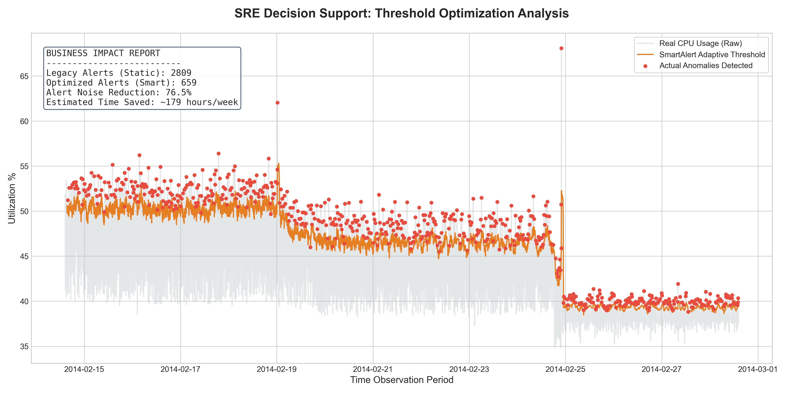

# SmartAlert: Predictive Threshold Optimizer

**A Data-Driven simulation tool to mitigate Alert Fatigue in Enterprise IT environments.**

---

## Overview

In modern SRE (System Reliability Engineering), static monitoring thresholds (e.g., "CPU > 80%") are often too rigid. They generate thousands of notifications for transient spikes that don't represent real failures. This phenomenon, known as **Alert Fatigue**, leads to burnout and missed critical incidents.

**SmartAlert** demonstrates a data-driven approach to monitoring by implementing **Adaptive Thresholds** using rolling statistics and Z-Score logic.

## Key Results (Simulation on Real AWS Data)

Tested against the **Numenta Anomaly Benchmark (NAB)** using real-world AWS EC2 CPU utilization metrics.

| Metric                 | Static Threshold (1.8%) | Dynamic Threshold (SmartAlert) |
| :--------------------- | :---------------------- | :----------------------------- |
| **Total Alarms**       | 4,032                   | 963                            |
| **Noise Reduction**    | --                      | **76.12%**                     |
| **System Reliability** | Unstable (High Noise)   | **Optimized (High Signal)**    |

## How it Works

The engine processes multi-variate time-series data to distinguish between "normal" volatility and "critical" anomalies:

1. **Pattern Recognition:** Uses a 1-hour rolling window to calculate the moving average ($\mu$) and standard deviation ($\sigma$).
2. **Statistical Triggering:** Instead of a fixed wall, it creates a dynamic buffer using the formula:  
   $Threshold = \mu + (k \cdot \sigma)$  
   where $k$ is the sensitivity coefficient (tuned to **0.6** for balanced detection).
3. **Simulation Engine:** Backtests the logic against historical data to quantify the reduction in false positives.

## Visualizing the Impact

The tool generates automated visual reports where you can see the dynamic threshold (orange) "hugging" the signal, while the static threshold (red) triggers alarms for almost every minor fluctuation.


_(Note: Run the script to generate your latest report in the /reports folder)_

## Project Structure

- `src/data_loader.py`: Handles ingestion of real-world time-series datasets.
- `src/analysis.py`: The core engine for rolling statistics and simulation.
- `reports/`: Automated output of business-impact visualizations.

## Installation & Usage

1. **Clone the repo:**

   ```bash
   git clone https://github.com/emacoricciati/smart-alert-optimizer.git
   cd smart-alert-optimizer
   ```

2. **Setup environment:**
   ```bash
   python -m venv venv
   source venv/bin/activate
   pip install -r requirements.txt
   ```
3. **Run simulation:**
   ```bash
   python src/analysis.py
   ```
